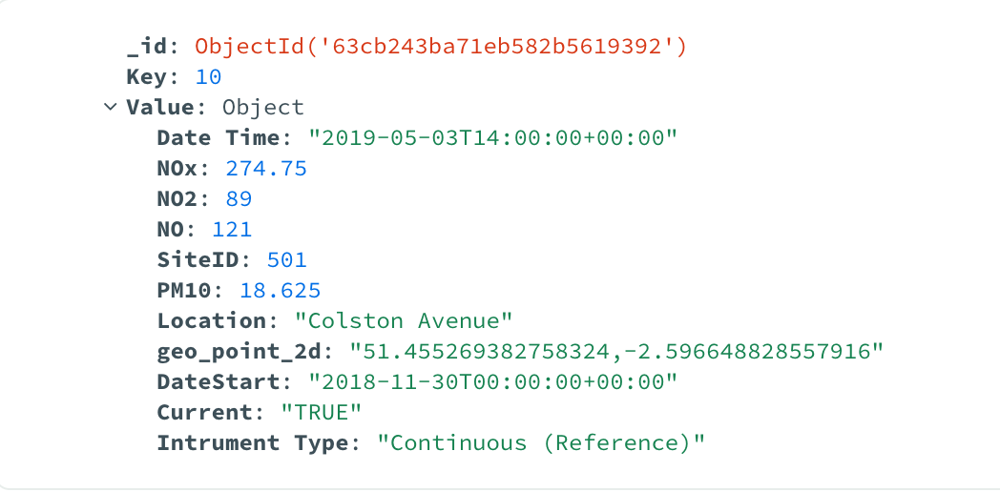
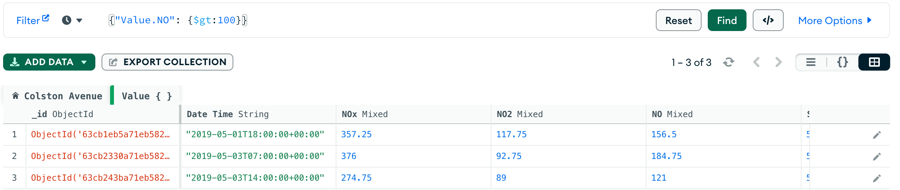
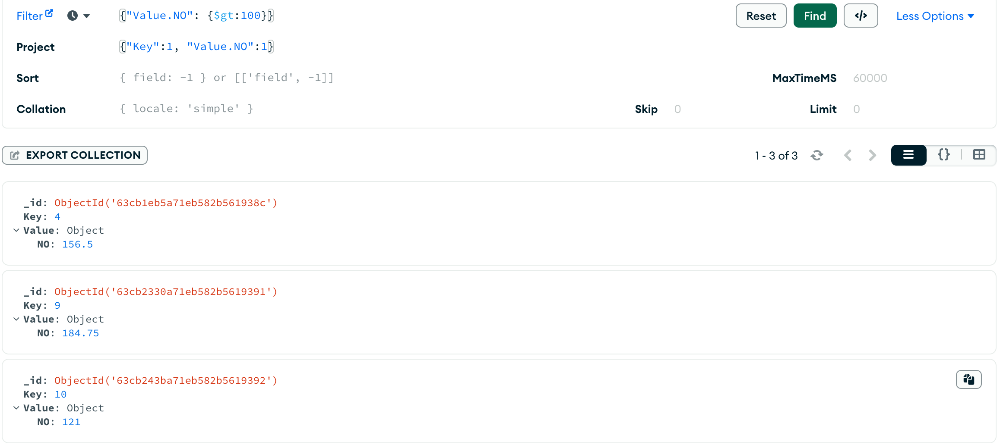

#### **INTRODUCTION ABOUT NOSQL DATABASES AND A SELECTED TYPE IN NOSQL DATABASE**

Traditional database systems have been based on the relational model for storing data. These are widely known as SQL databases. However, relational databases are not powerful when we have an extensive variety of gigantic information. In the last few years, enormous data such as structured, semi-structured and unstructured are growing very fast and more complex.  Relational data processing programs or applications are insufficient to manage them. To overcome this problem, NoSQL (Not only SQL) databases are designed, which are nonrelational databases uniquely intended to give high accessibility, reliability, and scalability for enormous data. NoSQL databases have become increasingly important in our day-to-day lives, with some of the most popular platforms and services. To begin my journey of doing with NoSQL data models, I have begun by researching four types of NoSQL data stores like **Key-Value Database** - The simplest type of NoSQL database, they are also the most scalable, allowing horizontal scaling of large amounts of data. Secondly, **Graph Database** - The structures are agile and flexible, and the graph represented the relationship between entities is explicit. Thirdly, **Document Database** - A non-relational database is made to store and query data in JSON-like documents. By employing the same document-model format as their application code, document databases make it simpler for developers to store and query data in a database. Document databases are flexible, semi-structured, and hierarchical in design, allowing them to change to meet the demands of applications. Finally, **Wide-Column Database**, which is a NoSQL database, allows for variations in the names and formats of the columns across rows and even within the same table. Data is kept in columns, making it possible to search rapidly for a certain value inside a column by swiftly loading the complete column. The same column family can be represented as including related columns. After a short time of researching and reading materials on setting up and implementing types of NoSQL data stores, I decided to choose the "Key-Value", which was the most popular and easy for me to understand the process and I looked into many sources on the Internet and library about how to acquire deeply about the Key-Value NoSQL data model.

#### **DATA MODEL**

NoSQL database stores data in a denormalized format. It is not necessary to use join to obtain all the data that is required. Instead, it is as simple as fetching the document. In the beginning, I created a denormalized table for "Colston Avenue" and a few values in this table. This enabled me to visualize the beginning of my data model and easily interpret the data.

My data model includes Keys and Values, in which the former is a unique identifier that maps to a value or a location of data being stored and the latter can be anything from simple data types like strings or integers to complex objects with multiple nested values. Unlike relational databases, key-value databases are a collection of key-value pairs that are stored as individual records and do not have a predefined data structure. In my data model, the key lies on the left-hand side and the values lie on the right-hand side. I picked up some recorded data about the Coston Avenue station to store. The values in my data model are imported from the "clean.csv" file to show one long line with the unique key and some values, and then when they go into a JSON structure. I will give an example of the key and values in the first row of my data model below:

1. the key is number 1
2. the value includes 
  - Date Time value is shown as Date Time: 2019-04-29T23:00:00+00:00
  - NOx value is displayed as NOx: 122.25
  - NO2 value is indicated as NO2: 49.25
  - NO value is expressed as NO: 47.75
  - SiteID value is revealed as SiteID: 501
  - PM10 value is shown PM10: 30.4
  - Location value is presented as Location: Colston Avenue
  -geo_point_2d value is demonstrated as geo_point_2d: 51.455269382758324, -2.596648828557916
  - DateStart value is exposed as DateStart: 2018-11-30T00:00:00+00:00
  - Current value is illustrated as Current: TRUE
  - Instrument Type is viewed as Instrument Type: Continuous (Reference) 

After picking up some recorded data from Coston Avenue, I began to look into different platforms of key-value NoSQL databases; for example, Amazon DynamoDB, MongoDB, ArangoDB, Oracle NoSQL Database, and more. I decided to choose MongoDB after reading a lot of documentation on these NoSQL databases. MongoDB stores data in collections, which are groups of BSON (Binary JSON) documents, each of which is effectively constructed from a field-value structure. MongoDB is an attractive key-value store because it can store flexible schema documents cheaply and create an index on any of the extra columns for random searches. In addition, MongoDB's document values support nested key-value structures, enabling access to and manipulation of data related to keys within documents as well as the creation of indexes that facilitate quick retrieval using these secondary types of keys. 

In addition, I have learnt more about JSON and XML. JSON is a data format that illustrated the value of objects, arrays, integers, texts, boolean and nulls. In order to provide field type information that directly correlates to each type in BSON, the format that MongoDB uses to store data, the Extended JSON format defines a reserved set of keys beginning with "$". Besides the JSON, the XML database is used to store a large amount of data in the XML format. As the use of XML is expanding across all industries, it is required to have a secure place to store XML documents. This data may be searched for, modified, exported, and then delivered back to the caller system. Due to the complexity of XML in NoSQL Databases as well as I could not find enough documentation to instruct me; therefore, I decided not to proceed with the XML.

In order to get MongoDB working, I had to install and run a local MongoDB Server. So, the first step I need to sign up for MongoDB Center to get the link connection. After that, I continued to install the MongoDB Compass and use the above connection to run the database in MongoDB. Eventually, when the installation process is done, I started to work with my Colston Avenue database in MongoDB Compass. In MongoDB Compass, the collection represented tables and documents illustrated rows. I have created the Colston Avenue collection to show any information. Each value is given a key where data is imported, resulting in the creation of the key-value store.

To get the data into MongoDB Compass, I created the “Colston Avenue” CSV file for ten records about Colston Avenue, referencing my data model. Then, I converted my CSV file to JSON format to map my data to a prior relational technique and import the records. The JSON sections of each record were divided into unique keys and given various properties to correlate to the CSV rows. Data is represented as an object or an array in JSON. A JSON object is a collection of names and values in no order. Some screenshots show 10 distinct assigned keys when using the import feature.

#### **SOME QUERIES ABOUT FILTER AND AGGREGATE FUNCTION**

Firstly, I tried to filter **the NO value greater than 100**. This sets the variable name goes to the Colston Avenue collection and filters the NO value > 100 and tells NoSQL to return the results. My query such as - **db.Colston Avenue.find({"Value.No": {$gt: 100}})**

Furthermore, instead of filtering the data greater than, you can filter the data greater than or equal - **($gte)**; less than - **($lt)** or less than or equal - **($lte)**.

Besides that, in order to save time, I directly wrote my query in the MongoDB Compass shown below:

As can be shown from the image that we have three keys such as key 4, key 9 and key 10, which met the condition (the value of NO greater than 100)

I will illustrate the detail of three above keys as below:

Secondly, I tried to filter **the key and the NO values**, which **NO value is greater than 100**.

Thirdly, I tried to sort **the key and the NO values**, which **NO value is greater than 21 with the NO value descends**. (-1: Descending and 1: Ascending)

The last query, I tried to write the query that shows the results of PM10 in Colston Avenue and the Date Time from the imported data. I used the aggrate function:

**db.Colston Avenue.aggregate([{$project:{$concat: ["The PM10","in", "$Value.Location", "was","$Value.PM10","on the","$Value.Date Time"]}}])**

This gets the location adds a string in, return the temperature, another string and return the datetime value. This is all done from the key store retrieving the information.

## Conclusion
To conclude, big data has indeed reshaped the way we deal with data. NoSQL databases alike have seen growth by providing an alternative to SQL databases. It has been found that for simple data that can be represented in the form of key-value easily, a key-value store should be chosen as it will provide high performance, scalability and flexibility.  If data can be represented in JSON format, a document store should be preferred as it has high performance, flexibility and usually high scalability. MongoDB could be a good solution for larger data sets in which the schema is constantly changing and it is the choice for users who need a less rigid database structure.